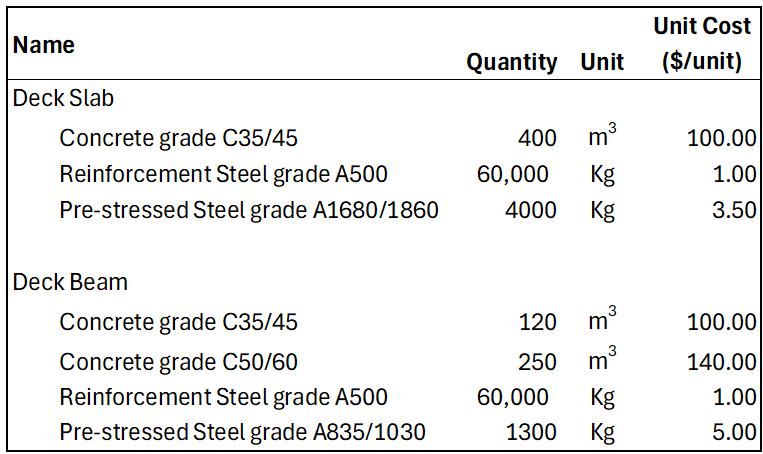
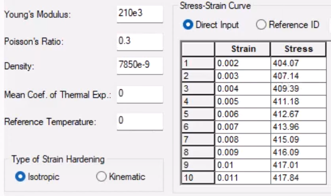
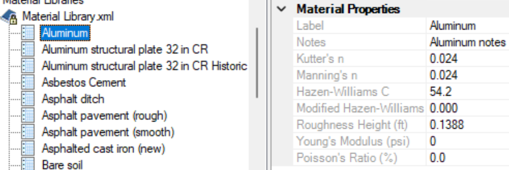

[[clause-reference]]
== Overview

Proper description of Materials used by Infrastructure projects is of great importance towards ensuring the reliability and soundness of the resulting assets. This is true across all lifecycle phases of an Infrastructure Asset, from Design and Construction all the way to Operation and Maintenance.

In this context, the focus on Materials goes well beyond the visualization aspect, which is typically referred to in terms of a _Texture_ or _Render Material_. It includes their semantical classifications as well as any applicable attribution needed for various use-cases during the lifecycle phases of an Infrastructure Asset.

For example, material information is key during the Design phase of an asset, dictating an important input into the overall cost-estimation of a project. It also leads to the definition of a `Bill of materials`, a list of raw materials, components and instructions that will be used during the Construction phase afterwards. <<figure-1, Figure 1>> shows a small sample of a Bill of materials, including cost-estimation, of the Slabs and Beams in an Infrastructure project involving a Bridge's Deck. Note that Construction Materials such as Concrete or Reinforcement Steel are specified according to the corresponding classifications at Standards Organizations such as ASTM International.

[[figure-1]]
.Sample of a Bill of Materials with Cost estimation

Furthermore, specialized material information is required for any kind of Physics-based Simulation, which are commonly used by Architects and Engineers at various lifecycle phases of an asset. They enable predictions on the behavior of an asset under certain conditions. Structural, Thermal or Hydraulic Analyses are examples of Physics-based Simulations. <<figure-2, Figure 2>> and <<figure-3, Figure 3>> depict attribution needed for each material in order to run Structural or Hydralic Analysis.

[[figure-2]]
.Material properties needed for Structural Analysis

[[figure-3]]
.Material properties needed for Hydraulic Analysis

Material information is also part of other important tasks in Infrastructure Projects. An average project spanning the design, construction, operation or maintenance of an Infrastructure asset typically involves several multi-disciplinary teams that need to work sometimes in parallel, other times sequentially, while still keeping a high level of coordination of their efforts. Thus, Data Interoperability is crucial to enable the correct exchange of information among teams, while Data Validation is a necessity in order to ensure no errors are introduced during such processes.

Advancements in AI and IoT have been raising the need for Infrastructure data to be captured in ways that machines can understand, which enables the automation of processes and tasks such as the ones previously described. This bold requirement translates into systems having to generally capture semantics and details of the concepts modeled in a standard and consistent manner. That need naturally applies to the semantics and attribution associated to materials in an Infrastructure project.

The following clauses present an overview of the state of the art of the modeling of materials in the international standards and software vendor technologies listed below:

* IFC by buildingSMART
* CityGML by OGC
* Base Infrastructure Schemas, <<BIS>>, by Bentley Systems
* Granta product-line by ANSYS

