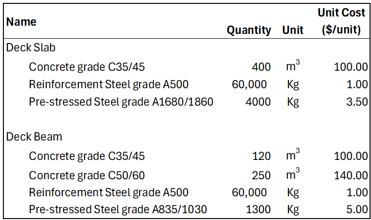
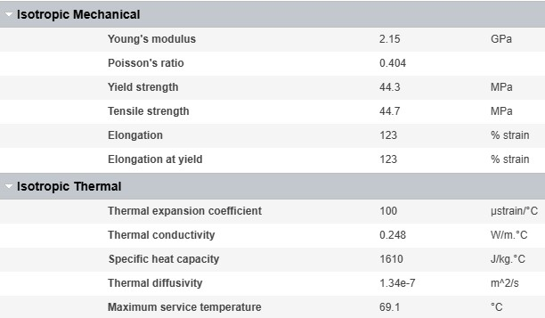
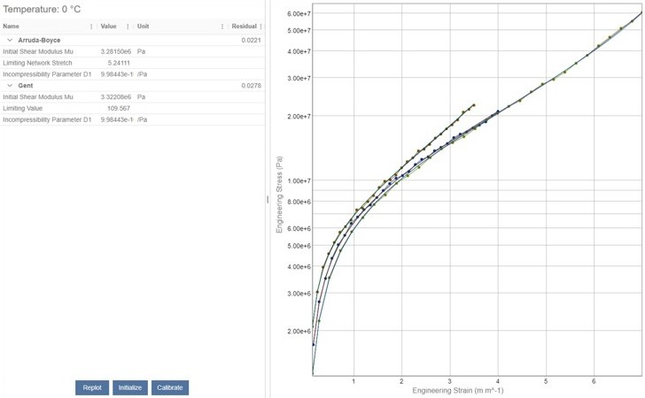
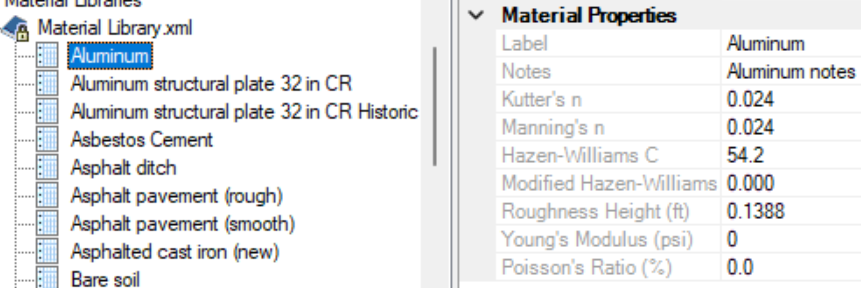

[[overview]]
== Overview

Proper description of Materials used in Infrastructure projects is of great importance towards ensuring the reliability and soundness of the resulting assets. This is true across all lifecycle phases of an Infrastructure Asset, from Design and Construction all the way to Operation and Maintenance.

In this context, the focus on Materials goes well beyond the visualization aspect, which is typically referred to in terms of a _Texture_ or _Render Material_. It includes their semantical classifications as well as any applicable attribution needed for various use-cases during the lifecycle phases of an Infrastructure Asset.

For example, material information is key during the Design phase of an asset, dictating an important input into the overall cost-estimation of a project. It also leads to the definition of a `Bill of materials` (<<BoMs, BoMs>>), a list of raw materials, components and instructions that will be used during the Construction phase afterwards. <<figure-1, Figure 1>> shows a small sample of a <<BoMs, BoMs>>, including cost-estimation, of the Slabs and Beams in an Infrastructure project that involves a Bridge's Deck. Note that Construction Materials such as Concrete or Reinforcement Steel are specified according to the corresponding classifications at Standards Organizations such as ASTM International.

[[figure-1]]
.Sample of a Bill of Materials with Cost estimation

Specialized material information is required for any kind of Physics-based Simulations, which are commonly used by Architects and Engineers at various lifecycle phases of an asset. They enable predictions on their behavior under certain conditions. Structural, Thermal, Signal Propagation and Hydraulic Analyses are examples of Physics-based Simulations.

- Structural integrity is a complex multicomponent, multiphysics challenge. With new materials empowering ever bolder designs, simulation is the only way to understand performance under normal and extreme loading conditions. Two examples include Fluid Structure Interaction (<<FSI, FSI>>) simulations footnote:[Examples of software products capable of executing FSI simulations include Ansys Fluent, Ansys Mechanical and Bentley ADINA] that can model wind load on a large structure, or seismic analysis under dynamic loading footnote:[Ansys Dyna, Bentley's STAAD and ADINA are examples of software products capable of executing seismic analysis under dynamic loading].

[[figure-2]]
.The definition of simple structural and thermal properties within Granta MI

Other, more advanced simulations, such as the effect of seismic loading may require more complex material models. For example, models which capture the hyperelastic behaviour of rubber based damping systems, or the complex failure models of reinforced concrete.

[[figure-3]]
.The definition of hyperelastic material models in Granta MI

- Digital models of interior ventilation are used to maximize energy efficiency and occupant comfort and safety. The combination of fluid dynamics and thermal analysis can achieve this footnote:[Ansys Fluent is a software product capable of combining fluid dynamics with thermal analysis].

- Radar and wireless communications designers face signal propagation challenges and automotive radar developers need accurate urban environment models to test system performance and safety, or to generate synthetic data for AI/ML training. footnote:[Software products such as Ansys Perceive EM can accurately model signal propagation in real-time through Shooting and Bouncing Ray (<<SBR, SBR>>) technology].

-  Water distribution and Stormwater networks, as well as drainage systems in any Infrastrure Asset, are examples of Hydraulic Systems. Their design requires executing simulations based on fluid mechanics in order to analyze the behavior of the Hydraulic System under various conditions. Specialized attribution of the materials of the components in contact with the modeled fluid are an important input to Hydraulic Analysis. <<figure-4, Figure 4>> depicts attribution needed for each material in order to execute an Hydralic Analysis footnote:[Bentley's OpenFlows offerings are examples of software products capable of executing hydraulic analysis].

[[figure-4]]
.Material properties needed for Hydraulic Analysis

All of these physics-based simulations require accurate material properties and models to deliver accurate results. 

Material information is also part of other important tasks in Infrastructure Projects. An average project spanning the design, construction, operation or maintenance of an Infrastructure Asset typically involves several multi-disciplinary teams that need to work sometimes in parallel, other times sequentially, while still keeping a high level of coordination of their efforts. Thus, Data Interoperability is crucial to enable the correct exchange of information among teams, while Data Validation is a necessity in order to ensure no errors are introduced during such processes.

Advancements in <<AI, AI>> and <<IoT, IoT>> have been raising the need for Infrastructure data to be captured in ways that machines can understand it without Human intervention, which enables the automation of processes and tasks such as the ones previously described. This bold requirement translates into systems having to generally capture semantics and details of the concepts modeled in a standard and consistent manner. That need naturally applies to the semantics and attribution of materials in an Infrastructure project.

The following clauses present an overview of the state of the art of the modeling of materials in the international standards and software vendor technologies listed below:

* <<IFC, IFC>> by buildingSMART
* 3D Tiles by OGC
* Base Infrastructure Schemas, <<BIS, BIS>>, by Bentley Systems
* Granta MI by Ansys
