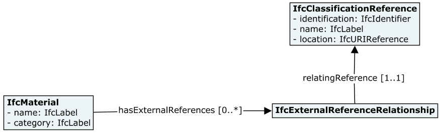

[[clause-reference]]
== Materials in IFC

Industry Foundation Classes <<IFC>> are a set of standardized, digital descriptions of the built asset industry. It is an open, global standard published under a Creative Commons license, and as ISO 16739. <<IFC>> provides machine interpretability of information and thereby enables automation of workflows. <<IFC>> is developed by buildingSMART.

Its class hierarchy includes https://standards.buildingsmart.org/IFC/RELEASE/IFC4_3/HTML/lexical/IfcMaterial.htm[IfcMaterial], whose instances represent "_a homogeneous or inhomogeneous substance that can be used to form elements (physical products or their components)_".

=== Material Classification

Instances of `IfcMaterial` can be identified via its `Name` string-based attribute, which may be required to be unique in a project. This attribute is appropriate to capture material names at the level needed by Reporting use-cases, such as Bill of Materials. 

The `IfcMaterial` class also includes a `Category` string-based attribute in order to capture a very general classification of materials. Examples include _concrete_, _steel_, _aluminum_, etc. Values in the `Category` attribute are not standardized by <<IFC>>.

<<IFC>> can optionally capture Material Classifications defined by International Standards as instances of https://standards.buildingsmart.org/IFC/RELEASE/IFC4_3/HTML/lexical/IfcClassificationReference.htm[IfcClassificationReference], which can then be associated to `IfcMaterial` instances via https://standards.buildingsmart.org/IFC/RELEASE/IFC4_3/HTML/lexical/IfcExternalReferenceRelationship.htm[IfcExternalReferenceRelationship]s. In that case, instances of `IfcClassificationReference` are expected to carry sufficient information to interpret material classification according to the names or classification keys defined by a specific Classification System.

<<figure-4, Figure 4>> shows a class diagram summarizing the three approaches available in <<IFC>> for material classification:

* IfcMaterial.Name
* IfcMaterial.Category
* IfcClassificationReference

[[figure-4]]
.Material Classification concepts in IFC

=== Material Attribution

Specialized attribution associated to an instance of `IfcMaterial` can be captured via sets of material properties captured by an instance of the https://standards.buildingsmart.org/IFC/RELEASE/IFC4_3/HTML/lexical/IfcMaterialProperties.htm[IfcMaterialProperties] class. <<IFC>> standardized several _Property Sets_ applicable to `IfcMaterial`s that are normally used in various kinds of Simulations. The following table lists a sample such _Property Sets_ and their associated kinds of Simulations.

[cols="4,4"]
.Sample of _Property Sets_ that capture specialized material attributes with applicable Kinds of Simulations
|===
|*Property Sets*|*Example of Applicable Simulation*
|Pset_MaterialMechanical|Structural Analysis
|Pset_MaterialConcrete|Structural Analysis
|Pset_MaterialWood|Structural Analysis
|Pset_MaterialSteel|Structural Analysis
|Pset_MaterialEnergy|Energy Analysis
|Pset_MaterialThermal|Thermal Analysis
|Pset_MaterialWater|Water-Quality Analysis
|===

