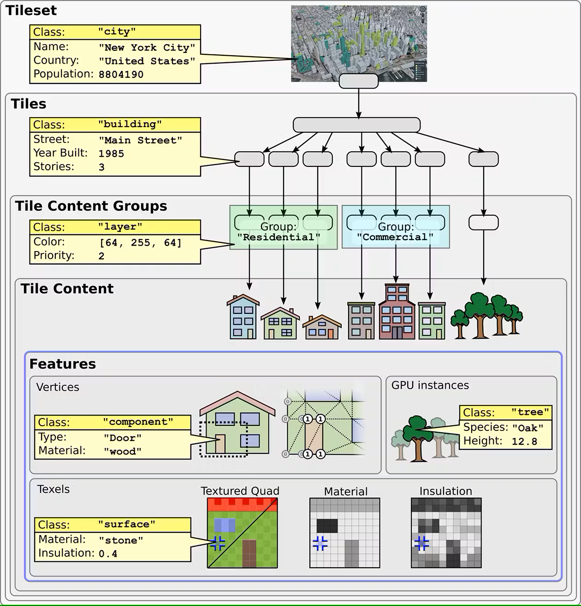

[[clause-reference]]
== Materials in Other Standards

=== CityGML

CityGML is an open standard, published by OGC, used for the storage and exchange of virtual 3D city models. CityGML allows the integration of urban geodata for use across a variety of applications, including urban and landscape planning; Urban Digital Twins for Smart Cities; the Metaverse; Building Information Modeling (<<BIM>>); mobile telecommunication; disaster management; 3D cadastre; tourism; vehicle & pedestrian navigation; autonomous driving and driving assistance; facility management; and energy, traffic, and environmental simulations. CityGML is useful for large areas and small regions, not just cities, and can represent real-world terrain and 3D objects at different Levels Of Detail (<<LOD>>) simultaneously.

==== Materials in CityGML

Referring specifically to materials, CityGML has standardized concepts to capture how surfaces of objects look like - their appearance. It has added support for various formats, including standards such as <<X3D>> and COLLADA. However, at the time of this writing, CityGML has not standardized any semantical classification of materials or associated attributions into its base model yet.

Nevertheless, a specific implementation of CityGML can capture material-related information by introducing it as application-specific attribution on top of base CityGML concepts. The following XML schema snippet shows the declaration of an extension of `WallSurface` in the underlying CityGML Building model with two custom string properties named `Material_Name` and `Material_Grade`.

.Sample CityGML Material attribution definitions
[source, xml]
<xsd:element
    name="Material_Name" 
    type="xsd:string" 
    substitutionGroup="bldg:_GenericApplicationPropertyOfWallSurface">
</xsd:element>
<xsd:element
    name="Material_Grade" 
    type="xsd:string" 
    substitutionGroup="bldg:_GenericApplicationPropertyOfWallSurface">
</xsd:element>

The following GML snippet shows `WallSurface` data containing `Material_Name` and `Material_Grade` values based on the application-specific Material attribution extensions depicted above.

.Sample CityGML data using the Material attribution extensions
[source, xml]
<bldg:Building 
    xmlns:bldg="http://www.opengis.net/citygml/building/2.0">
  <bldg:boundedBy>
    <bldg:WallSurface>
      ...
      <app:Material_Name>Concrete</app:Material_Name>
      <app:Material_Grade>Portland Cement Type III</app:Material_Grade>
      ...
    </bldg:WallSurface>
  </bldg:boundedBy>
</bldg:Building>

=== 3D Tiles

3D Tiles is an open standard, published by OGC, designed for streaming and rendering massive 3D geospatial content such as Photogrammetry, 3D Buildings, BIM/CAD, Instanced Features, and Point Clouds. It defines a hierarchical data structure and a set of tile formats which are used to efficiently manage and display 3D content, optimising performance by dynamically loading appropriate levels of detail.

3D Tiles allows for the encoding of information associated to any level of its hierarchical data structure - including tile-set, tile, individual geometry and a pixel within it. 3D Tiles refers to associated information as _metadata_. <<figure-8, Figure 8>> shows an example of _metadata_ assigned at various granularities in a hierarchical tile structure.

[[figure-6]]
.Example metadata at various granularities in 3D Tiles

==== Materials in 3D Tiles

3D Tiles can capture semantics behind any attribute, as part of 3D Tiles' _metadata_. The 3D Tiles specification includes the standardization of some common semantics used by _metadata_ properties. However, at the time of this writing, such standardization of semantics has not included any classification or attribution of material information yet.

Nevertheless, a specific implementation of 3D Tiles can capture material-related information by introducing it as application-specific attributes. The following class declaration snippet, encoded in JSON according to the 3D Tiles specification, shows the definition of a two string properties named `Material_Name` and `Material_Grade`, onto a class named `Column`.

{
  "entity": {
    "class": "Column",
    "properties": {
      "stringProperty": "Material_Name",
      "stringProperty": "Material_Grade"
    }
  }
}
