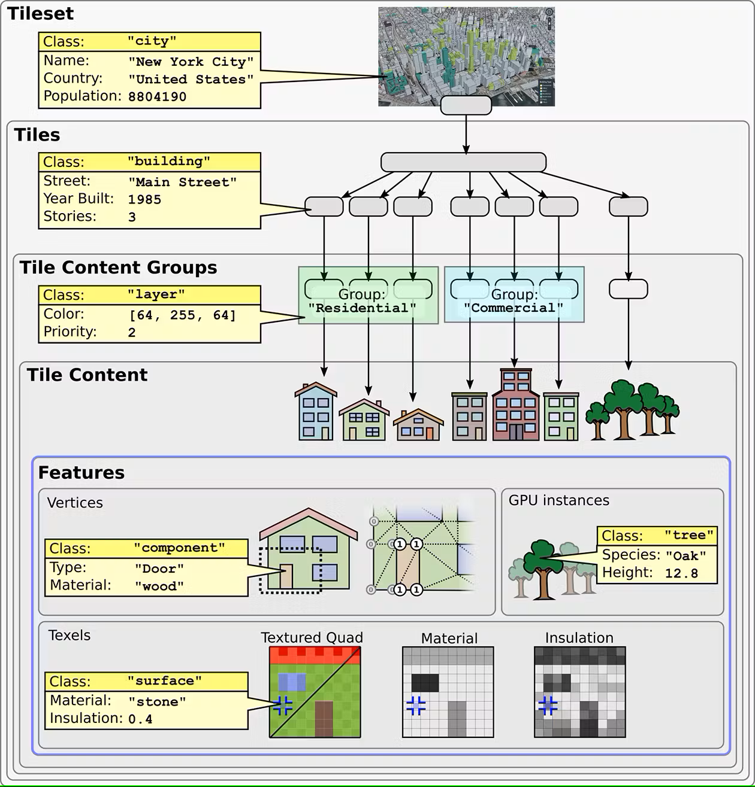
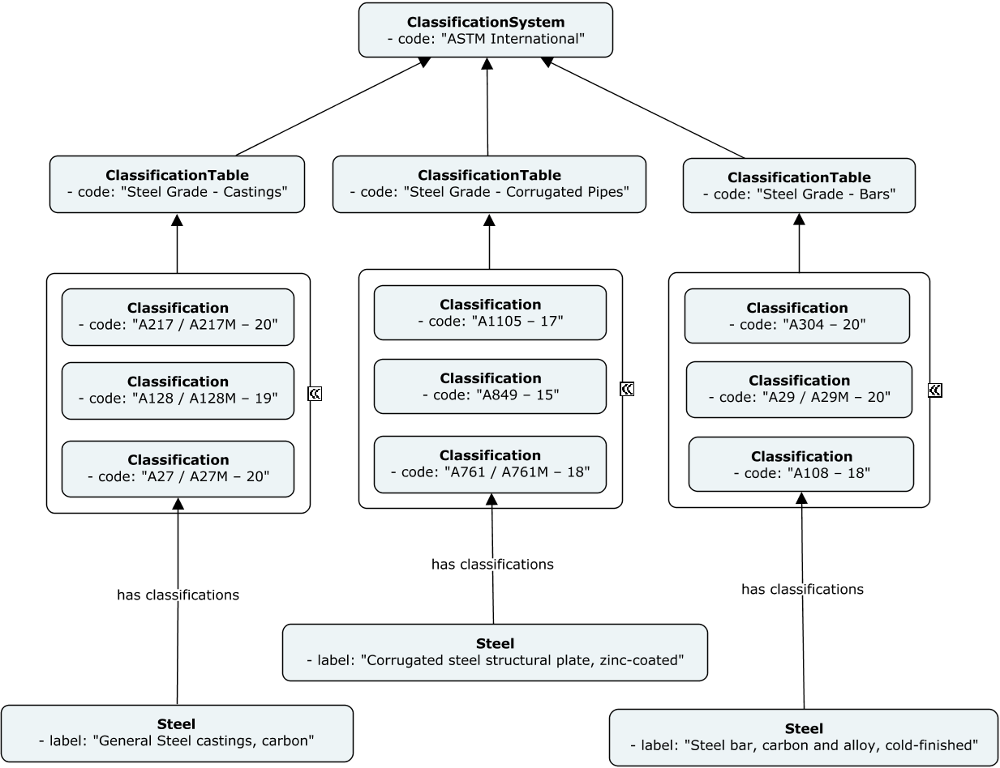

== Materials in BIS

<<BIS, BIS>> stands for Base Infrastructure Schemas. It is an ecosystem of modular schemas for modeling concepts and data about an infrastructure asset. It is an Open Source effort led by Bentley Systems, Inc.

<<BIS, BIS>> models Materials with two parallel concepts, as follows:

- Render Material: captures the rendering properties of materials for display purposes.
- Physical Material: focuses on describing the matter of which physical objects are made of.

Thus, <<BIS, BIS>>' https://www.itwinjs.org/bis/guide/physical-perspective/physical-materials/[Physical Material] is the concept relevant for the main topic of this discussion paper. 

=== Material Classification

A Physical Material in <<BIS, BIS>> is modeled via a class-hierarchy with a common base-class - `PhysicalMaterial` - defined under the `DefinitionElement` branch of the ecosystem. Definition Elements in <<BIS, BIS>> model information meant to be referenced or shared. <<figure-8, Figure 8>> depicts some of the Physical Material classes that BIS has standardized so far in its ecosystem.

[[figure-8]]
.Material Class Hierarchy in BIS

<<BIS, BIS>> uses the `PhysicalMaterial` class-hierarchy to encode a general classification of materials that can be understood by machines. More specific classifications can be captured in BIS via one of the following two approaches:

1. By capturing _well known names_ or _classification keys_ as `Codes` of the instances of any concrete `PhysicalMaterial` sub-class.
1. By capturing _well known names_ or _classification keys_ in instances of the `Classification` class that are associated with corresponding `PhysicalMaterial` instances.

Any instance in the <<BIS, BIS>> ecosystem, called _Element_, can optionally carry a human-friendly _business key_ that is unique in a certain context, and thus, it can be used as a form of identification. This special property of any <<BIS, BIS>> _Element_ is referred to as _Code_. The first approach can rely on the _Code_ property of `PhysicalMaterial` instances to capture the desired _classification key_. <<figure-9, Figure 9>> shows a few sample instances of the `Steel` class, with their _Code_ properties assigned to their _classification key_ according to ASTM International.

[[figure-9]]
.Sample Steel Instances with classification keys and descriptions

The <<BIS, BIS>> ecosystem contains a set of classes meant to capture _Classification Systems_ that can be used to provide parallel classifications to <<BIS, BIS>> instances. They can be used to capture a more complete representation of a _Classification System_, or to classify any <<BIS, BIS>> instance according to two or more _Classification Systems_ in parallel. <<figure-10, Figure 10>> shows the same `Steel` instances from <<figure-9, Figure 9>> but this time associated to more complete classification tables according to ASTM International, by using <<BIS, BIS>> _ClassificationSystems__ classes.

[[figure-10]]
.Sample Steel Instances classified based on BIS ClassificationSystems classes

=== Material Attribution

Being modeled as instances, `PhysicalMaterial` _BIS elements_ can carry specialized attribution. In general, <<BIS, BIS>> offers two approaches to capture attribution information for any _element_:

1. As first-class properties of a BIS Element-class
1. As properties of a BIS Element-Aspect class

The second approach is the one applicable to material attribution. A BIS Element-Aspect class captures sets of properties that can be optionally attached to an _Element_. In the case of Material attribution, it enables the definition of Element-Aspect classes that capture sets of properties per specialized Kind of Simulation. These _Element-Aspects_ can then be associated to particular `PhysicalMaterial` instances. <<figure-11, Figure 11>> shows instances of the `Steel` class, attributed with mechanical properties, defined in the `SteelMechPropertiesAspect` _Element-Aspect_ class, attached to those instances.

[[figure-11]]
.Sample Steel Instances with Attribution via Element-Aspects

The following table lists a sample of _Element-Aspect_ classes that capture specialized material attribution and their associated kinds of Simulations.

[cols="4,4"]
.Sample of _Element-Aspect_ classes that capture specialized material attributes with applicable Kinds of Simulations
|===
|*Element-Aspect*|*Example of Applicable Simulation*
|GenericMechPropertiesAspect|Structural Analysis
|ConcreteMechPropertiesAspect|Structural Analysis
|SteelMechPropertiesAspect|Structural Analysis
|HydraulicMaterialAspect|Hydraulic Analysis
|===
