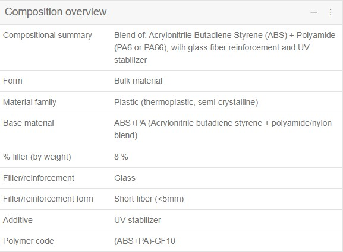

== Materials in Granta MI

=== Overview

Granta MI is a commercial Materials Data Management (MDM) system by Ansys and has been developed over the last 20 years to manage materials data for many industries and applications including design & simulation, test data management, sustainability, and computational materials design. It has a flexible schema, which allows it to be configured to many different use cases, but to aid implementation and standardization a number of templated configurations have been developed incorporating best practice for MDM. The use of schema element _building blocks_ allow new configurations to be quickly developed, while retaining the best practice standards and interoperability with downstream systems such as simulation.

=== Material Classification

As Granta MI is a database system, each material is represented as a record in the system. There are two methods to classify materials.

- Tree based hierarchy: A parent-child hierarchy of record groups can be defined allowing for a very flexible classification system that can be intuitive for users to navigate. This gives the flexibility to classify materials from many different material classes, e.g., metals, polymers, composites, and glasses where the method of classification can vary widely. However, this tree structure is more difficult to navigate and interrogate programmatically which is a requirement for seamless integration into digital engineering and digital twin workflows.

[[figure-13]]
.A typical hierarchical materials classification in Granta MI

- Attribute based: Rather than a hierarchy, each material can be classified by a number of different attributes which by combination, will uniquely identify that material. These are the most common classes of attributes used to describe a material.
    * Composition: How the composition of a material is classified varies between material class. Metals are defined by elemental composition, polymers by polymer class and any reinforcements, fillers or additives, and concretes by cement, aggregates, additives and reinforcements.
    * Form, Processing & Post-processing: The form of the material, such as sheet, tube, or fiber, is important for inclusion in BoMs, but can also have an impact on its properties. How the material is processed, or any post-processing steps, such as heat-treatment, can have a major impact on performance, but varies between material classes.
    * Performance: Some materials are classified by their properties or performance, for example the strength or hardness of a metal, the optical qualities of glass, or the thermal performance of insulation.
    * Standards: Many industries define standards for the materials used, and can be a combination of composition, form and performance, and will often define minimum requirements.

The use of these attributes means that the materials can easily be filtered and analyzed by the user and programmatically. A tree hierarchy can also be built from these attributes giving flexibility in user experience. However, when classifying many different material classes, the number of attributes required will be large, leading to redundancy. Granta MI has a number of standard templates to classify materials, from a simple set of attributes which can be used across all material classes, to more complex sets for a detailed classification of a particular class of materials.

[[figure-14]]
.A simple attribute-based classification system in Granta MI
image::figures/PT1_FIG14.jpg[Material Attribution in Granta MI]

=== Material Attribution

The properties of materials are captured in Attributes defined in the schema. Like most database systems, these attributes can be a number of different data-types, e.g. numerical, text, lists, files and images. As the system was developed specifically for engineering data, it has a number of complex data types that can be utilized such as tables, grids, data series, and mathematical expressions. This allows for a very flexible data structure, but for key use cases, preconfigured templates are available to promote best practice, standardization and interoperability.